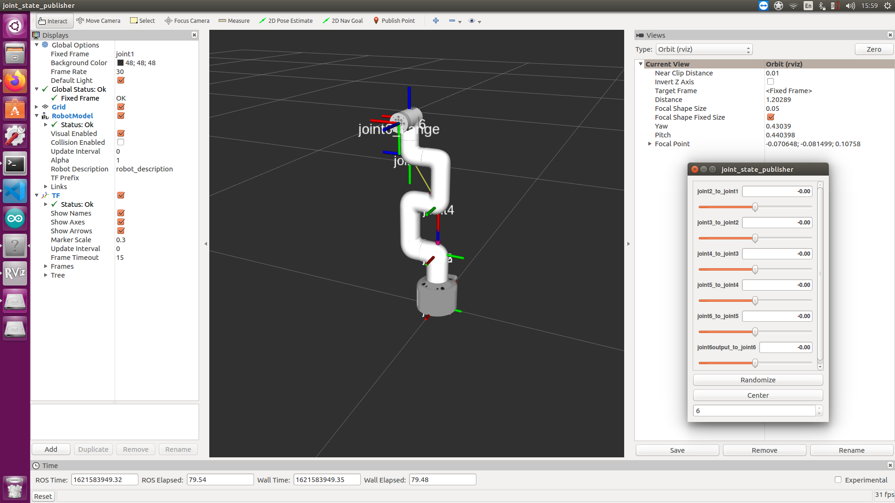

# mycobot_ros

[](READMEcn.md)

[English](README.md) | [中文](READMEcn.md)



**Notes**:

<!-- This is the mycobot ROS package designed by Zhang Lijun([lijun.zhang@elephantrobotics.com]()) -->

> Make sure that `Atom` is flashed into the top Atom and `Transponder` is flashed into the base Basic .The tool download address: [https://github.com/elephantrobotics/myCobot/tree/main/Software](https://github.com/elephantrobotics/myCobot/tree/main/Software)<br>
> ubuntu: 16.04LTS<br>
> ros version: 1.12.17

**If your `Atom` is 2.3 or before, or `pymycobot` is 1.\*, Please check branch [before](https://github.com/elephantrobotics/myCobotRos/tree/before)**

Download ROS [http://wiki.ros.org/ROS/Installation](http://wiki.ros.org/ROS/Installation)


## 1. Installation
### Option 1: Docker
There are two ways to run this project. The first is by running the project in a container, and this requires
[installing docker](https://docs.docker.com/engine/install/ubuntu/) and
[installing docker-compose](https://docs.docker.com/compose/install/). The benefit of running in the container is that you can run the project in any version of linux, as long as your kernel
is new enough. 

Once docker is installed, run the following command, and the project should show up:

```
docker-compose build ros && xhost +local:root && docker-compose up ros
```

This command does three things:
1) `docker-compose build ros`
   
   This builds the project in a container. That means nothing is installed on your host machine!
   The first time this runs, this command will take a long while. After running it once, caching 
   will allow this command to run quickly.
   
2) `xhost +local:root`

   This command gives X the ability to display GUI's from within the docker container

3) `docker-compose up ros`

   This runs the image specified in the `docker-compose.yml`, which by default runs
   the command `roslaunch mycobot_ros control_slider.launch` within the container.
   

### Option 2: Local
#### 1.1 Pre-Requriements

For using this package, the [Python api](https://github.com/elephantrobotics/pymycobot.git) library should be installed first.

```bash
pip install pymycobot --user
```

#### 1.2 Package Download and Install

Install ros package in your src folder of your Catkin workspace.

```bash
$ cd ~/catkin_ws/src
$ git clone https://github.com/elephantrobotics/mycobot_ros.git
$ cd ~/catkin_ws
$ catkin_make
$ source ~/catkin_ws/devel/setup.bash
```

#### 1.3 Test Python API

```bash
cd ~/catkin_ws/src/mycobot_ros
python scripts/test.py
```

## 2. Package Modules

### 2.1 Nodes

- `display` is a display node. When the node is running, the model of ROS will show the movement of mycobot synchronously.
- `control_slider` is the node which slider bar control.
- `control_marker` is the node which use interactive marker control.

### 2.2 Topics

- `joint_states` - control mycobot status.

  ```
  Message_type: std_msgs/JointState
  Data: position[float, float, float, float, float, float]
  ```

## 3. Visualization in RViz

### 3.1 Functions

- Visualization -- display.launch: This function will display robot arm movement in realtime when you manually move mycobot.

- Control -- control.launch: This function will allow you use slider bar to control movement of the robot arm.

### 3.2 Lanuch and Run

- **Use slide bar to control**

  - launch ros and rviz

  ```
  roslaunch mycobot_ros mycobot_slider.launch
  ```

  - run python script

  ```
  rosrun mycobot_ros slider_control.py
  ```

- **The model moves with the real manipulator**

  - launch ros and rviz

  ```
  roslanuch mycobot_ros mycobot_follow.launch
  ```

  - run python script

  ```
  rosrun mycobot_ros follow_display.py
  ```

- **Open the keyboard controller**

  - launch

  ```
  roslaunch mycobot_ros mycobot_teleop_keyboard.launch PORT:=/dev/ttyUSB0
  ```

  - open another terminal run script

  ```
  rosrun mycobot_ros teleop_keyboard.py _speed:=60 _change_size:=10
  ```

  Then you will see this:

  ```
  Mycobot Teleop Keyboard Controller
  ---------------------------
  Movimg options(control coord [x,y,z,rx,ry,rz]):
                w(x+)
  
      a(y-)     s(x-)     d(y+)

      z(z-) x(z+)
  
  u(rx+)   i(ry+)   o(rz+)
  j(rx-)   k(ry-)   l(rz-)
  
  Gripper control:
      g - open
      h - close
  
  Other:
      1 - Go to init pose
      2 -
      3 -
      q - Quit
  
  currently:      speed 50        change size 10 
  ```

## MoveIT

### Execute plan with actual robot.

```
roslaunch mycobot_ros demo.launch
```

Open a new terminal and run:

```
rosrun mycobot_ros sync_signal.py
```

<!-- If you use the above command, then you may need to manually add some model components. If you don't want to be so troublesome, you can use the following command to load a saved **myCobot** model.

```bash
rosrun rviz rviz -d rospack find mycobot_ros/config/mycobot.rviz
``` -->

## Q & A

**Q: error[101]**

**A:** Make sure that the serial port is not occupied, and that the correct firmware is burned in for atom and basic
